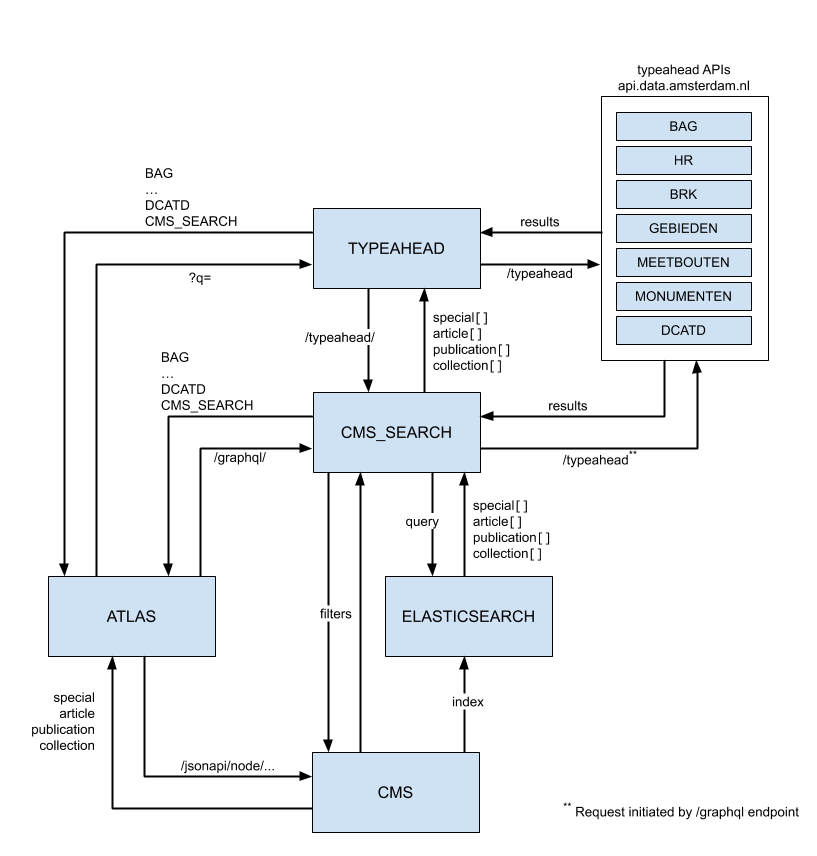

# Decisions prior to architectural decision documentation

## Using Elasticsearch for CMS content indexing

Date: unknown

### Status

Accepted

### Context

The `data-verkenner` application is, and has mostly been, depending on output of different APIs that are available throughout the municipality (see [api.data.amsterdam.nl](https://api.data.amsterdam.nl/)). The output of several of those APIs[*](#Typeahead APIs) was used for searching and visualizing data in the application based on those search results. To display the search results, a proxy API is used.

To also offer background stories and articles related to the data from the municipality, the decision was made to introduce a CMS by which other content could be published on data.amsterdam.nl. The different types of content available1 are:
- articles
- publications
- specials and
- collections

#### Typeahead APIs

Several APIs within the municipality of Amsterdam offer searching through their data by full text search. All of that data is indexed by Elasticsearch. It concerns the following APIs:

- [BAG](https://api.data.amsterdam.nl/data-verkenner/typeahead/bag/)
- [HR](https://api.data.amsterdam.nl/handelsregister/typeahead/)
- [BRK](https://api.data.amsterdam.nl/data-verkenner/typeahead/brk/)
- [Gebieden](https://api.data.amsterdam.nl/data-verkenner/typeahead/gebieden/)
- [Meetbouten](https://api.data.amsterdam.nl/meetbouten/typeahead/)
- [Monumenten](https://api.data.amsterdam.nl/monumenten/typeahead/)

The proxy API [api.data.amsterdam.nl/typeahead](https://api.data.amsterdam.nl/typeahead) returns results for all of the above as well as results from the [Dataset catalogue](https://api.data.amsterdam.nl/dcatd/datasets). The `data-verkenner` application uses an autosuggest component that shows the output of the proxy API.

### Decision

To be able to have the output of the proxy API also contain matches from the CMS content, the CMS content needs to be indexed by Elasticsearch, since that is the solution already in place for the proxied APIs. This means that the CMS needs to be able to push content to an Elasticsearch index and the index should be accessible by the proxy API. Moreover, querying Elasticsearch generally takes less time than performing queries on a CMS's JSON endpoint, for instance in the case of the chosen CMS, Drupal.

Each change in the content in the CMS will update the Elasticsearch index. There will be no more than a couple of thousand records in the database for the foreseeable future.

The communication, with the introduction of the Elasticsearch index, will roughly look like this:

----

1 At the time of writing
